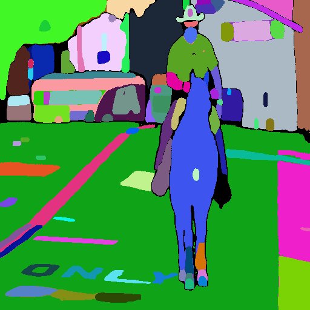

# T2I-Adapters & Training code for SDXL in Diffusers

This is the initial code to make T2I-Adapters work in SDXL with Diffusers. The UNet has changed in SDXL making changes necessary to the diffusers library to make T2IAdapters work. I intend to upstream the code to diffusers once I get it more settled. A training script is also included.

## Sample Input and Output

Here is a sample input mask:

And here is the corresponding output:

An iPython notebook is included to show how to use the the pipeline. Please note that the segmentation adapter is a 1 channel adapter, so the input mask should be a single channel mask if you are going to use it. You can train an adapter to use any given number of channels.